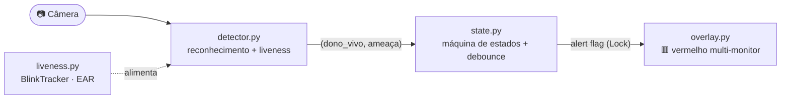
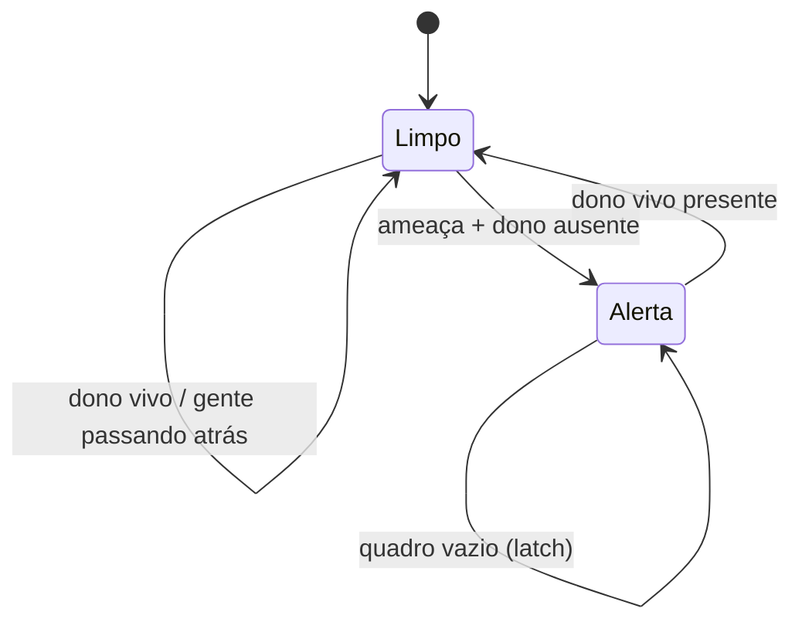

<div align="center">
  <!-- TODO(readme-glorify): trocar pelo logo real em .github/assets/logo.svg (120x120) -->
  

  <h1>Camera Guardian</h1>

  <p><strong>Deixe o Mac desbloqueado — mas defendido. Aproximou-se um rosto que não é o seu, a tela explode em vermelho: <em>"SAI DAI VAGABUNDO"</em>.</strong></p>

  <p>
    <a href="./LICENSE"></a>
    <a href="#roadmap"></a>
    <a href="https://www.python.org"></a>
    <a href="https://github.com/gabdevbr/camera-guardian"></a>
    <a href="./tests"></a>
  </p>

  <p>
    <a href="#quickstart"><strong>Quickstart</strong></a> ·
    <a href="#features">Features</a> ·
    <a href="#arquitetura">Arquitetura</a> ·
    <a href="./docs/">Docs</a>
  </p>
</div>

<br />

<!-- TODO(readme-glorify): adicionar demo (GIF do alerta disparando) em .github/assets/hero.gif -->

> [!NOTE]
> Projeto de **dissuasão** (a clássica zoeira de máquina desbloqueada), não controle de acesso de nível bancário. O reconhecimento e o anti-spoofing rodam **100% local** — nenhuma imagem sai da máquina.

## Contents

- [Features](#features)
- [Quickstart](#quickstart)
- [Install](#install)
- [Usage](#usage)
- [Configuration](#configuration)
- [Arquitetura](#arquitetura)
- [Módulos](#módulos)
- [Roadmap](#roadmap)
- [Contributing](#contributing)
- [License](#license)
- [Acknowledgements](#acknowledgements)

## Features

- **🎯 Reconhece o dono, não estranhos** — embeddings de 128d ([`face_recognition`](https://github.com/ageitgey/face_recognition)/dlib). Sua cara → tela normal; rosto desconhecido → alerta.
- **👁️ Anti-spoofing por piscada** — *liveness* via EAR (Eye Aspect Ratio): uma **foto sua não pisca**, então não engana o guardião.
- **🤝 Prioridade dono-vivo** — se você (vivo) está na tela, **não dispara nem com gente passando atrás**. O guardião protege quando você **sai**.
- **🖥️ Alerta em todos os monitores** — o vermelho cobre cada tela conectada (via `screeninfo`), com fallback pra tela única.
- **🧪 Lógica testada** — a máquina de estados e o liveness são lógica pura, cobertos por **16 testes**.
- **🚀 Launcher zero-config** — `./start.sh` cria a venv, instala dependências e valida o cadastro antes de subir.
- **🔒 Privacidade por padrão** — fotos e embeddings ficam fora do git; sem rede, sem telemetria, sem nuvem.

## Quickstart

```bash
git clone https://github.com/gabdevbr/camera-guardian.git && cd camera-guardian
./start.sh                               # cria a venv + instala deps (avisa pra cadastrar)
source .venv/bin/activate
python capture.py && python enroll.py    # cadastra seu rosto (1x): ESPACO=foto, Q=sai
./start.sh                               # liga o guardião 🚨
```

> [!IMPORTANT]
> Libere a **Câmera** para o seu terminal em **Ajustes do Sistema → Privacidade e Segurança → Câmera**. Ao chegar, há ~1-2s de vermelho até a sua primeira piscada (o liveness exige prova de vida) — some sozinho.

## Install

**Pré-requisitos (macOS):**

```bash
brew install python-tk@3.14 cmake      # Tk p/ o overlay + cmake p/ compilar o dlib
```

| Passo | Comando |
|---|---|
| Clonar | `git clone https://github.com/gabdevbr/camera-guardian.git` |
| Entrar | `cd camera-guardian` |
| Ambiente + deps | `./start.sh` *(cria `.venv`, instala `requirements.txt`)* |
| Manual (alternativa) | `python3 -m venv .venv && source .venv/bin/activate && pip install -r requirements.txt` |

Dependências: `opencv-python`, `face_recognition` (compila o `dlib`), `numpy`, `screeninfo`, `setuptools<81`.

## Usage

**1. Cadastrar seu rosto** (uma vez) — clique na janela da câmera, depois aperte ESPAÇO:

```bash
source .venv/bin/activate
python capture.py     # tira 3-5 fotos variando ângulo/luz (ESPACO/S = foto, Q/ESC = sai)
python enroll.py      # gera encodings.npy
```

**2. Ligar o guardião:**

```bash
./start.sh            # ou: python guardian.py
```

**Comportamento:**

| Cenário | Resultado |
|---|---|
| Você (vivo) na frente | 🟩 Tela normal |
| Alguém passa **atrás** de você | 🟩 Continua normal (dono-vivo tem prioridade) |
| Você sai + estranho aparece | 🟥 Vermelho em todos os monitores |
| Mostram uma **foto** sua | 🟥 Foto não pisca → continua/fica vermelho |

**ESC** esconde o alerta na hora (failsafe) · **Ctrl+C** no terminal encerra.

## Configuration

Tudo ajustável em [`config.py`](./config.py):

| Parâmetro | Default | Descrição |
|---|---|---|
| `TOLERANCE` | `0.6` | Distância máx. p/ reconhecer o dono (menor = mais rígido) |
| `DEBOUNCE_FRAMES` | `3` | Quadros consecutivos p/ trocar de estado (anti-flicker) |
| `DOWNSCALE` | `0.25` | Redução do quadro antes da detecção (menor = mais rápido) |
| `DETECTION_MODEL` | `"hog"` | `"hog"` (CPU) ou `"cnn"` (GPU) |
| `EAR_THRESHOLD` | `0.21` | Abaixo disso o olho conta como fechado |
| `LIVENESS_WINDOW_FRAMES` | `45` | Por quantos quadros uma piscada mantém você "vivo" |
| `LIVENESS_RESET_ABSENT` | `5` | Quadros sem o dono p/ exigir nova piscada |
| `ALERT_TEXT` | `"SAI DAI VAGABUNDO"` | O grito da tela |

## Arquitetura

Pipeline: a câmera roda numa thread de fundo; o overlay roda na main thread (exigência do Tkinter); entre eles, lógica pura e testável.



A decisão de ligar/desligar o alerta é uma máquina de estados pura:



Prioridade por quadro: **dono-vivo › ameaça › vazio (mantém o estado)**. "Vivo" = reconhecido **e** piscou recentemente — é o que derruba o ataque de foto.

## Módulos

| Arquivo | Responsabilidade | Testável |
|---|---|---|
| [`config.py`](./config.py) | Tunables | — |
| [`state.py`](./state.py) | Máquina de estados (decisão + debounce) | ✅ pura |
| [`liveness.py`](./liveness.py) | EAR + `BlinkTracker` (anti-spoofing) | ✅ pura |
| [`detector.py`](./detector.py) | Câmera + reconhecimento + liveness | 🔌 hardware |
| [`capture.py`](./capture.py) · [`enroll.py`](./enroll.py) | Cadastro do rosto → `encodings.npy` | 🔌 hardware |
| [`overlay.py`](./overlay.py) | Alerta Tkinter multi-monitor | 🖥️ GUI |
| [`guardian.py`](./guardian.py) | Orquestra tudo (thread + main) | 🔌 integração |

Mais detalhe em [`CLAUDE.md`](./CLAUDE.md) (cheat-sheet) e [`AGENTS.md`](./AGENTS.md) (regras de engenharia). Privacidade em [`docs/security.md`](./docs/security.md); erros comuns em [`docs/troubleshooting.md`](./docs/troubleshooting.md).

## Roadmap

- [x] Reconhecimento do dono + alerta vermelho fullscreen
- [x] Anti-spoofing por piscada (liveness/EAR)
- [x] Prioridade dono-vivo (ignora quem passa atrás)
- [x] Overlay em todos os monitores
- [ ] Anti-replay de **vídeo** (textura/moiré anti-tela, challenge-response)
- [ ] Som no alerta
- [ ] Empacotar como `.app` com login item

## Contributing

PRs e issues são bem-vindos! Antes de mandar:

```bash
PYTHONPATH=. python -m pytest tests/ -v    # 16 testes precisam passar
```

- **Bugs / ideias:** [Issues](https://github.com/gabdevbr/camera-guardian/issues)
- Mantenha `state.py` e `liveness.py` **puros** (sem câmera/GUI) e cubra novos comportamentos com teste — ver [`AGENTS.md`](./AGENTS.md).

## License

[MIT](./LICENSE) © 2026 gabdevbr

## Acknowledgements

Construído sobre [`face_recognition`](https://github.com/ageitgey/face_recognition) (Adam Geitgey), [dlib](http://dlib.net/) (Davis King) e [OpenCV](https://opencv.org/). A detecção de piscada segue o EAR de Soukupová & Čech (2016).
